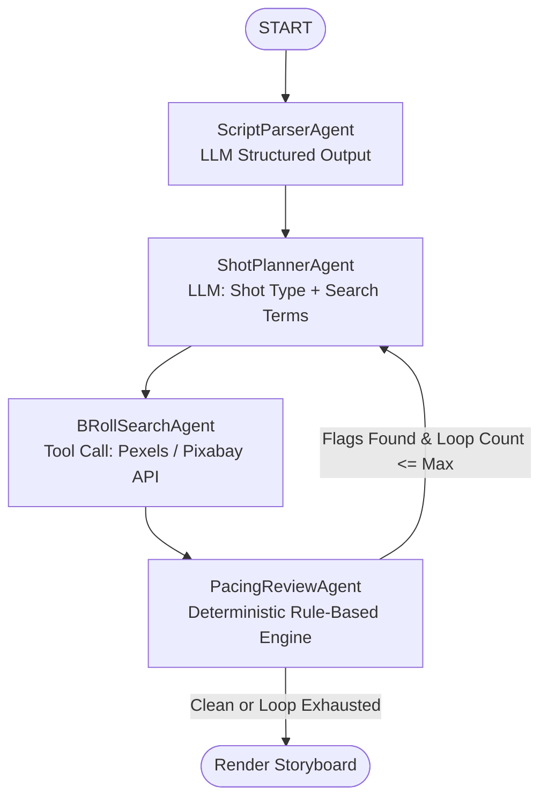

# 🎬 YouTube Script-to-Storyboard Agent

An AI-driven pipeline built with **LangGraph** that converts raw YouTube narration scripts into structured, shot-level storyboards — complete with automated B-roll sourcing and deterministic pacing analysis.

[](https://www.python.org/)
[](https://streamlit.io/)
[](https://www.langchain.com/langgraph)

---

## Table of Contents

- [Overview](#overview)
- [Architecture](#architecture)
- [Pipeline Components](#pipeline-components)
- [Repository Structure](#repository-structure)
- [Getting Started](#getting-started)
- [Running the Application](#running-the-application)
- [Testing](#testing)
- [Design Decisions](#design-decisions)
- [Known Limitations](#known-limitations)
- [Roadmap](#roadmap)
- [Contributing](#contributing)
- [License](#license)

---

## Overview

Video editors and YouTube automation creators routinely spend hours manually breaking scripts into beat sheets, researching B-roll search terms, and estimating visual pacing before editing can even begin.

This project automates that pre-production workflow. By combining LLM-driven structured extraction with deterministic, rule-based algorithms, the agent produces shot-level storyboards, sources real stock footage from Pexels/Pixabay, and self-corrects pacing issues through a single controlled loop-back pass.

---

## Architecture

The pipeline is a state graph with one controlled loop-back edge. Of the four nodes, two invoke an LLM (script parsing, shot planning) and two are pure deterministic Python (B-roll search, pacing review) — this keeps latency, cost, and non-determinism confined to the steps that actually need reasoning.



---

## Pipeline Components

| Node | Type | Description |
|---|---|---|
| `ScriptParserAgent` | LLM | Splits the raw script into semantic visual "beats" (1–3 sentences each), with a regex sentence-splitting fallback for scripts over ~80 words if the LLM call fails. |
| `ShotPlannerAgent` | LLM | Assigns shot types (`talking_head`, `b_roll`, `text_overlay`, `screen_recording`, `graphic_chart`), production notes, and 2–3 concrete stock search terms per beat. Batches beats (20 per call) and incorporates pacing feedback on revision passes. |
| `BRollSearchAgent` | Tool | Queries the Pexels and Pixabay APIs in parallel (`ThreadPoolExecutor`, max 4 workers), with per-query LRU caching and exponential-backoff retries. |
| `PacingReviewAgent` | Rule Engine | Deterministically flags beats for visual fatigue (talking-head > 14s), minimum shot duration (< 2.5s for duration-sensitive shots), and text complexity vs. duration (Flesch-Kincaid grade ≥ 10 packed into < 6s). |

The graph runs a single revision loop by default (`max_loops=1`): if the pacing reviewer flags any beat, only the flagged beats are re-planned and re-searched before the storyboard is finalized.

---

## Repository Structure

```text
YouTube-Script-to-Storyboard-Agent/
├── app.py                     # Streamlit frontend application
├── graph/                     # LangGraph state machine and nodes
│   ├── state.py                 # Pydantic schemas (Beat, StoryboardState, ShotType)
│   ├── prompts.py                # System and agent instruction prompts
│   ├── nodes.py                   # Node implementations (Parser, Planner, Search, Review)
│   ├── graph_builder.py            # StateGraph assembly and conditional routing
│   ├── llm_factory.py               # Primary/fallback LLM provider selection (Gemini <-> Anthropic)
│   └── ui_theme.py                   # Streamlit CSS theme
├── tools/                     # Deterministic utilities and external API clients
│   ├── broll_search.py          # Pexels and Pixabay API integrations
│   └── pacing_utils.py          # Rule-based pacing and readability algorithms
├── tests/                     # Test suite (currently empty stubs — see Testing section)
├── sample_scripts/            # Sample scripts for manual validation
├── test_run.py                 # Standalone end-to-end smoke-test script
├── requirements.txt           # Pinned project dependencies
├── .env.example                # Template for required environment variables
└── README.md
```

---

## Getting Started

### Prerequisites

- Python 3.10+
- A **Google Gemini** API key (`GOOGLE_API_KEY`) — this is the **default** LLM provider
- An **Anthropic** API key (`ANTHROPIC_API_KEY`) — used as the automatic fallback provider
- A Pexels and/or Pixabay API key (free tiers supported; B-roll search degrades gracefully without them)

> The pipeline defaults to Gemini (`LLM_PROVIDER=gemini`) and falls back to Claude on failure. Both providers attempt structured output, so it's safest to configure both keys — the app will raise a combined error if neither is set.

### Installation

```bash
git clone https://github.com/Ibrahim-Asghar-03/YouTube-Script-to-Storyboard-Agent.git
cd YouTube-Script-to-Storyboard-Agent

# Create and activate a virtual environment
python -m venv venv
source venv/bin/activate  # On Windows: venv\Scripts\activate

# Install dependencies
pip install -r requirements.txt
```

### Environment Configuration

Copy the example environment file and populate it with your credentials:

```bash
cp .env.example .env
```

```env
LLM_PROVIDER=gemini
GOOGLE_API_KEY=your_google_key_here
ANTHROPIC_API_KEY=your_anthropic_key_here
PEXELS_API_KEY=your_pexels_key_here
PIXABAY_API_KEY=your_pixabay_key_here

# Optional: LangSmith observability
LANGCHAIN_TRACING_V2=true
LANGCHAIN_API_KEY=your_langchain_key_here
LANGCHAIN_PROJECT=yt-storyboard-agent
```

Per-node provider overrides are also supported via `LLM_PROVIDER_<NODE_NAME>` (e.g. `LLM_PROVIDER_SHOT_PLANNER=anthropic`).

---

## Running the Application

```bash
streamlit run app.py
```

1. Open `http://localhost:8501` in your browser.
2. Paste your YouTube narration script.
3. Adjust the **Narration Pace (WPM)** slider (120–180, default 150).
4. Click **Generate Storyboard** to view the timeline, beat cards, and B-roll previews.
5. Use **Download CSV** to export the shot plan.

Each browser session is capped at 5 generations (`MAX_RUNS_PER_SESSION`); reload the page to reset the counter.

---

## Testing

```bash
pytest tests/
```

> **Status:** `tests/test_parser.py`, `test_planner.py`, `test_broll.py`, and `test_pacing.py` currently exist as empty placeholder files — `pytest tests/` collects 0 tests today. See [Known Limitations](#known-limitations) and [Roadmap](#roadmap).

For a manual end-to-end smoke test against live LLM/API credentials, run:

```bash
python test_run.py
```

This executes the full graph against `sample_scripts/sample1.txt` and prints each beat's duration, shot type, and B-roll link to the console.

---

## Design Decisions

- **Deterministic word/duration calculation** — word counts and durations are computed in Python, not by the LLM, avoiding arithmetic drift.
- **Infinite loop prevention** — the conditional route caps revision at `max_loops`, so a single stubborn pacing flag can't cause runaway retries.
- **Fail-safe parsing** — a regex sentence splitter engages automatically if the LLM parsing call fails on scripts over ~80 words.
- **Dual-provider resilience** — every structured-output call attempts a primary provider (Gemini) and falls back to a secondary (Claude) before failing the node.

---

## Known Limitations

These were identified while reviewing and running the current codebase:

- **Test suite is unimplemented.** All four files under `tests/` are empty; there is no automated coverage for the pacing engine, parser fallback, planner, or B-roll caching yet, despite being referenced in the pipeline design.
- **Stale B-roll on revision.** `broll_search_node` only fetches footage for beats with no existing `broll_assets`. When a beat is re-planned during the pacing revision loop with new search terms, its previously fetched B-roll is not cleared or re-queried, so the displayed footage can silently mismatch the updated search terms.
- **Unassigned shot types aren't recovered.** If the planner LLM omits a beat from its output batch, that beat's `shot_type` stays `None` for the rest of the run — the pacing reviewer won't flag it (so it never gets re-planned), and `test_run.py`'s `beat.shot_type.upper()` call will raise on such beats (the Streamlit UI itself handles this case gracefully).
- **No Markdown export.** Only CSV export is implemented in the UI.
- **No LICENSE file** is currently included in the repository.

---

## Roadmap

- [ ] Implement the four pending unit test modules (parser fallback, planner batching/feedback, B-roll caching, pacing rules)
- [ ] Clear `broll_assets` when a beat's `broll_search_terms` change during a revision pass, so re-planned beats always re-query for footage
- [ ] Default unassigned beats to a safe `shot_type` (or force a re-plan) instead of leaving `shot_type=None`
- [ ] Add a Markdown export option alongside CSV
- [ ] Add a GitHub Actions workflow to run `pytest` and linting on every PR
- [ ] Add a LICENSE file
- [ ] Surface per-provider (Gemini/Anthropic) failure reasons in the Streamlit UI instead of one combined error string

---

## Contributing

Issues and pull requests are welcome. Before submitting a PR, please:

1. Run `pytest tests/` (once test coverage lands) and `python -m py_compile` across changed files.
2. Keep new nodes and tools consistent with the existing pattern: LLM calls go through `invoke_structured`, deterministic logic stays dependency-free of any LLM client.

---

## License

No `LICENSE` file is currently included in this repository. Add one (e.g. MIT) to formalize usage terms before relying on this project in downstream work.
